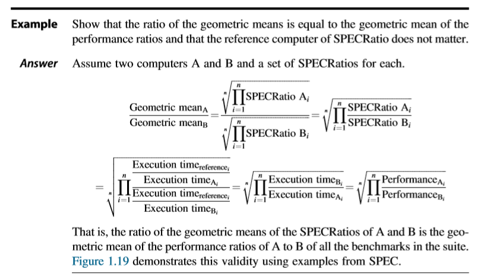
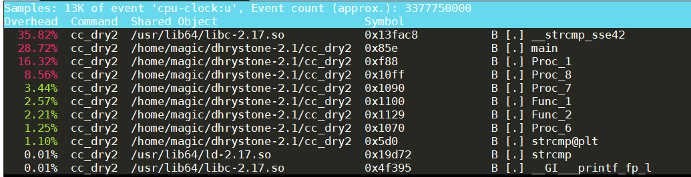
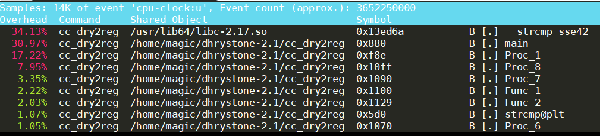
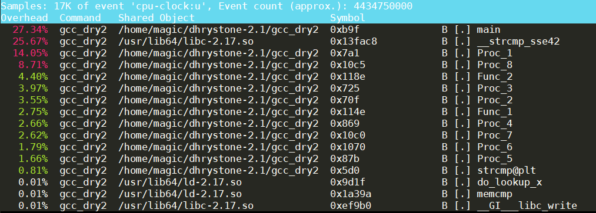
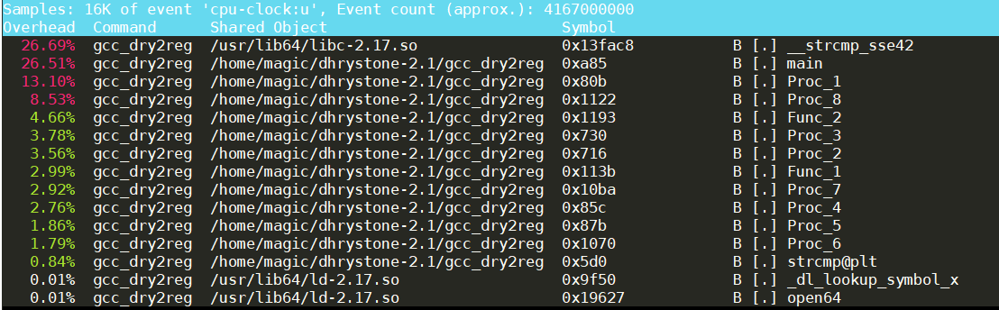

# 计算机组织与体系结构实习Lab 1: 处理器性能评测

麦景

1700012751

[TOC]

* [计算机组织与体系结构实习Lab 1: 处理器性能评测](#计算机组织与体系结构实习lab-1-处理器性能评测)
  * [评测程序](#评测程序)
  * [文献阅读](#文献阅读)
     * [相对性能指标](#相对性能指标)
     * [Profile实例](#profile实例)
        * [whetstone](#whetstone)
        * [dhrystone](#dhrystone)
     * [编程语言对性能的影响](#编程语言对性能的影响)
  * [性能评测](#性能评测)
     * [工作背景和评测目标](#工作背景和评测目标)
     * [评测环境](#评测环境)
     * [评测步骤及要求](#评测步骤及要求)
        * [Dhrystone](#dhrystone-1)
        * [whetstone](#whetstone-1)
        * [SPEC CPU2000](#spec-cpu2000)
     * [评测结果及简要分析](#评测结果及简要分析)
     * [Summary](#<summary>)
------

## 评测程序

>  1. 我们针对系统评测的不同角度会采用不同的评测程序. 在目前已有的评测程序中, 为下列评测目标找到某些合适的评测程序(列出即可).

| 评测目标           | 评测程序                                  | 评测目标           | 评测程序                |
| ------------------ | ----------------------------------------- | ------------------ | ----------------------- |
| CPU整点性能        | CINT2017                                  | CPU浮点性能        | CFP2017                 |
| 计算机事务处理能力 | TPC-E                                     | 嵌入式系统计算能力 | Dhrystone, EEMBC        |
| 2D处理能力         | GFXBench2D                                | 3D处理能力         | SPECapc, GFXBench3D     |
| 并行计算性能       | SPECrate, ACCEL, MPI2007, OMP2012         | 系统响应速度       |                         |
| 编译优化能力       |                                           | 操作系统性能       |                         |
| 多媒体处理能力     | SiSoftware Sandra                         | IO处理能力         | TPC-C, TPC-W, SPECsfs97 |
| 浏览器性能         | [BrowserBench](https://browserbench.org/) | 网络传输速率       | netperf                 |
| Java运行环境性能   | SPECJVM                               | 邮件服务性能       | SPECmail                |
| 文件服务器性能     | SPECSFS                                   | Web服务器性能      | SPECWeb                 |
| 服务器功耗和性能   | SPCEpower_sjj2008, TPC-Energy             |                    |                         |

> *Conception: **SPECRatio***(<u>use geometric means</u>)
>
> Using the geometric mean ensures two important properties:
>
> 1. the geometric mean of ratios = the ratio of the geometric means
> 2. The choice of the reference computer is irrelevant.
>
> 

*Credit to:*

- *Computer Architecture: A Quantitative Approach*, Chapter 1.8 & Appendix D
- [The Standard Performance Evaluation Corporation (SPEC)](http://spec.org/)
- [Transaction-processing Concil(TPC)](http://www.tpc.org)
- [Unified cross-platform 3D graphics benchmark database](https://gfxbench.com/)

## 文献阅读

阅读文献(*Reinhold P.Weicker, An Overview of Common Benchmarks, IEEE Computer, December 1990.*), 并回答下面的问题.

### 相对性能指标

> 1. 简述用于性能评测的MIPS指标之含义，以及它是如何被计算的.

MIPS字面意思是 millions of instructions per second, 但是随着CISC的出现逐渐失去了意义. 现在重新定义"VAX MIPS", 度量性能与VAX 11/780之间的比值. 运行评测程序需要控制的变量有编程语言, 编译器, 评测角度等.

### Profile实例

> 2. 使用Linux下的剖视工具（例如`gprof`）对`dhrystone`和`whetstone`进行剖视，参考论文Table 1形式给出数据，你的结果和该论文是否一致，为什么？

#### whetstone

由于`gprof`采样频率过低(采样周期为0.01s), 无法记录单次执行时间少于0.01s的函数. 我们采用`vtune`进行profile. 假设`amplxe-cl`已在路径当中:

```shell
$ cd whetstone
$ make debug
$ amplxe-cl -V
$ amplxe-cl -collect hotspots ./debug/whetdc 300000
$ amplxe-cl -report hotspots -format=csv  > whetstone_300000.csv
```

整理后的statistics如下:

| 行标签                  | 求和项:CPU Time | Percent |                   |        |
| ----------------------- | --------------- | ------- | ----------------- | ------ |
| main                    | 5.030017        | 33.99%  |                   |        |
| P3                      | 1.599985        | 10.81%  |                   |        |
| P0                      | 0.529996        | 3.58%   |                   |        |
| PA                      | 0.599998        | 4.05%   | User Code         | 52.43% |
| Trigonometric functions | 2.979982        | 20.14%  |                   |        |
| Other math functions    | 4.040002        | 27.30%  | Library functions | 47.43% |
| Others                  | 0.020002        | 0.14%   |                   |        |
| 总计                    | 14.799982       | 100.00% |                   |        |

完整数据见[此](./whetstone/whetstone_300000.xlsx). 其与论文中Table 1给的数据不太一致, 在具体结果上能细微差别, 比如P0(Indexing)时间占比远小于论文中的数据, 可能的原因是Cache的大小不同.

#### dhrystone

课程给的`dhrystone`版本过老, 会发生`times`重复定义的情况, 参考[Errors while compiling dhrystone in unix](https://stackoverflow.com/questions/9948508/errors-while-compiling-dhrystone-in-unix)对代码进行修改. 我们使用`prof`来进行profile(假设已安装`prof`).

Usage: 对`makefile`进行修改后, 方便进行profile:

```shell
$ cd whetstone
$ make clean
$ make prof-cc_dry2
$ make prof-cc_dry2reg
$ make prof-gcc_dry2
$ make prof-gcc_dry2reg
```

profile结果如下,  `number of runs`均为100000000:

`cc_dry2`



`cc_dry2reg`



`gcc_dry2`



`gcc_dry2reg` 



这个结果与论文中Table 3的结论不太一致. 在这次实验中的hotspots是library function`strcmp`, 但在论文中仅仅占用不足10%. 同时, 我们也看到了不同编译器和寄存器分配策略也会对profile结果造成影响.

### 编程语言对性能的影响


> 3. 论文中讨论了处理器之外可能对性能造成影响的因素，请分别使用两种不同的语言（例如C和Java）使用同一算法实现快速排序、矩阵乘法、求Ackermann函数，验证文中的观点。（请保留你的程序，我们在后面可能还会用到它).

除了处理器之外, 论文讨论了可能对性能造成影响的因素有:

- 编程语言
- 编译器
- 运行库
- cache的大小

不同编译语言, 在函数调用序列, 指针语法和字符串语法等方面的不同会导致性能的差异.

C语言写的代码在目录[CBenchmark](./CBenchmark)下, 进入该目录运行`prof.sh`即可, 编译优化选项为`-O4`.

```bash
> cd CBenchmark
> ./prof.sh
Usage: ./prof.sh <gemm|quick_sort|ackermann> <...params>
          ./prof.sh gemm <N> <K> <M>
          ./prof.sh quick_sort <N>
          ./prof.sh ackermann <m> <n>
```

Java语言写的代码在目录[JavaBenchmark](./JavaBenchmark)中. 测试使用了较新的Java 11.

```bash
> java -version
openjdk version "11.0.6" 2020-01-14 LTS
OpenJDK Runtime Environment 18.9 (build 11.0.6+10-LTS)
OpenJDK 64-Bit Server VM 18.9 (build 11.0.6+10-LTS, mixed mode, sharing
```

在相同[评测环境](#评测环境)下两者评测结果如下.

|                             | C(Elasped Time/ms) | Java(Elasped Time/ms) |
| :-------------------------: | ------------------ | --------------------- |
| gemm(N=1000, K=1000,M=1000) | 278                | 1379                  |
|   quick_sort(N=100000000)   | 16181              | 18348                 |
|     ackermann(m=4, n=1)     | 1960               | 6994                  |

*Tips: 运行Java程序发生栈溢出情况时可以通过添加编译选项`-Xss<stack size>` 调整栈大小, 如`-Xss1M`*, 同理也可以用`-Xmx<heap size>`调整栈大小.

## 性能评测

基于某个给定的计算机系统平台，使用`dhrystone`、`whetstone`、`SPEC CPU2000`开展评测、分析、研究并给出报告.

### 工作背景和评测目标

轻量应用服务器(Simple Application Server)是可快速搭建且易于管理的轻量级云服务器, 其提供基于单台服务器的应用部署，安全管理，运维监控等服务, 可用于搭建个人网站, 云端学习环境, 电商建设, 社区论坛等. 与阿里云ECS云服务相比, 阿里云轻量应用服务器采用与ECS共享版相同的CPU, 但其系统盘升级为SSD, 磁盘读写性能有更大的提升.

在本次实验中, 我们将评测阿里云轻量应用服务器的处理器性能.  

###  评测环境

| **项目**                                                     | **详细指标和参数**                                           |
| ------------------------------------------------------------ | ------------------------------------------------------------ |
| 处理器型号及相关参数（频率、架构、缓存等）  `cat /proc/cpuinfo` | model name      : Intel(R) Xeon(R) Platinum 8163 CPU @ 2.50GHz<br />cache size      : 33792 KB |
| 内存     `free -h`                                           | 2G                                                           |
| 外存     `df -h`                                             | 40G                                                          |
| 操作系统及其版本     `lsb_release -a`                        | LSB Version:    :core-4.1-amd64:core-4.1-noarch<br/>Distributor ID: CentOS<br/>Description:    CentOS Linux release 7.7.1908 (Core)<br/>Release:        7.7.1908<br/>Codename:       Core |
| 编译器版本  （及编译参数）  `gcc -v`                         | gcc (GCC) 4.8.5 20150623 (Red Hat 4.8.5-39)<br /><br />Configured with: ../configure --prefix=/usr --mandir=/usr/share/man --infodir=/usr/share/info --with-bugurl=http://bugzilla.redhat.com/bugzilla --enable-bootstrap --enable-shared --enable-threads=posix --enable-checking=release --with-system-zlib --enable-__cxa_atexit --disable-libunwind-exceptions --enable-gnu-unique-object --enable-linker-build-id --with-linker-hash-style=gnu --enable-languages=c,c++,objc,obj-c++,java,fortran,ada,go,lto --enable-plugin --enable-initfini-array --disable-libgcj --with-isl=/builddir/build/BUILD/gcc-4.8.5-20150702/obj-x86_64-redhat-linux/isl-install --with-cloog=/builddir/build/BUILD/gcc-4.8.5-20150702/obj-x86_64-redhat-linux/cloog-install --enable-gnu-indirect-function --with-tune=generic --with-arch_32=x86-64 --build=x86_64-redhat-linux<br/>Thread model: posix |
| 库函数及其版本                                               | Glibc 2.17                                                   |

### 评测步骤及要求

#### Dhrystone

> 1. 在linux下基于dhrystone-2.1所提供的Makefile编译dhrystone.

[如上所述](#dhrystone)进行修改即可编译通过.

> 2. 分别采用$10^8$、$3\times 10^8$、$5\times 10^8$、$7\times 10^8$、$9\times 10^8$为输入次数，运行编译生成的两个程序，记录、处理相关数据并做出解释。

完整数据记录见[dhrystone_statistic.xlsx](./dhrystone_statistic.xlsx), 进入目录[dhrystone-2.1](./dhrystone-2.1), 编译完成后运行脚本[dhrystone_profile.sh](./dhrystone_profile.sh)即可. 单个测试点重复三次, 采用几何平均值. 整理后的数据如下.

|        | `gcc_dry2` | `gcc_dry2rag` | Ratio |
| ------ | ---------- | ------------- | ----- |
| 10^8   |     13889210.85       |    14007816           |    1.008539372   |
| 3*10^8 |       13731956.07     |     14341841.31          |   1.044413573    |
| 5*10^8 |      13863504.27      |     13769938.94          |  0.993250961     |
| 7*10^8 |     13908838.08       |     14193107.31          |  1.020438029     |
| 9*10^8 |      13923625.55      |        13890154.73       |   0.997596113    |

> 3. 对dhrystone代码做少量修改，使其运行结果不变但“性能”提升.


> 4. 采用dhrystone进行评测有哪些可改进的地方？对其做出修改、评测和说明.


#### whetstone

> 1. 在linux下使用编译器分别采用-O0、-O2、-O3选项对whetstone程序进行编译并执行，记录评测结果.

进入目录[whetstone](./whetstone), 更改文件makefile中的编译选项对whetstone程序进行编译和执行, 并固定`Loop Count`为10000000. 整理后的结果如下, 完整数据见[whetstone_statistics.xlsx](./whetstone_statistics.xlsx).

| 编译优化选项 | MIPS |
| ------------ | ---- |
| -O0          |      |
| -O2          |      |
| -O3          |      |

> 2. 分别采用10^6, 10^7, 10^8, 10^9为输入次数，运行编译生成的可执行程序，记录、处理相关数据并做出解释.

完整数据记录见[whetstone_statistics.xlsx](./whetstone_statistics.xlsx), 进入目录[whetstone](./whetstone), 编译完成后运行脚本[whetstone_profile.sh](./dhrystone_profile.sh)即可. 单个测试点重复三次, 采用几何平均值. 整理后的数据如下.

| Loop Count | MIPS |
| :--------: | ---- |
|    10^6    |      |
|    10^7    |      |
|    10^8    |      |
|    10^9    |      |


> 3. 进一步改进whetstone程序性能（例如新的编译选项），用实验结果回答.

我们选用Intel提供的编译器`icc`进行编译.

#### SPEC CPU2000

> 1. 完成SPEC CPU2000的安装.


> 2.  修改自己的config文件，分别用低强度优化（例如O2）和高强度优化（例如O3）完成完整的SPEC CPU2000的评测，提交评测报告文件.


### 评测结果及简要分析

### Summary