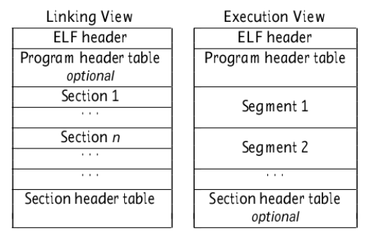
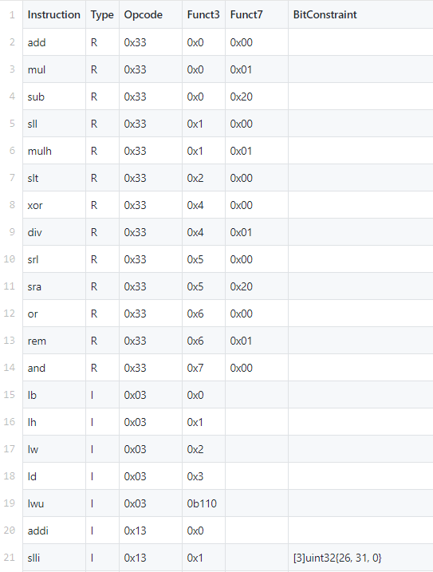
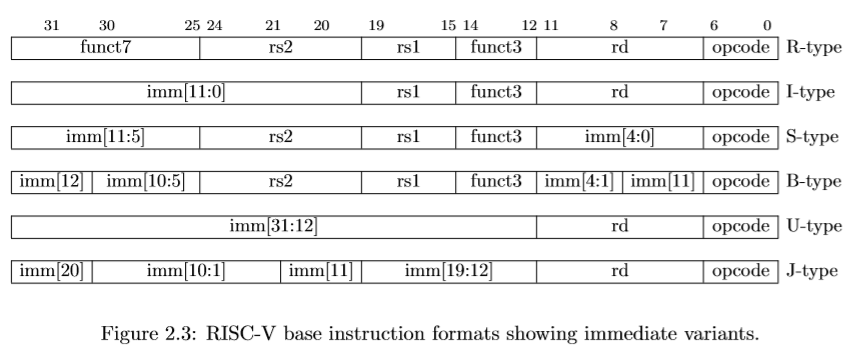
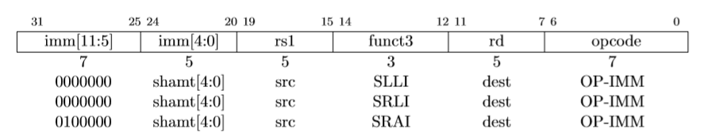
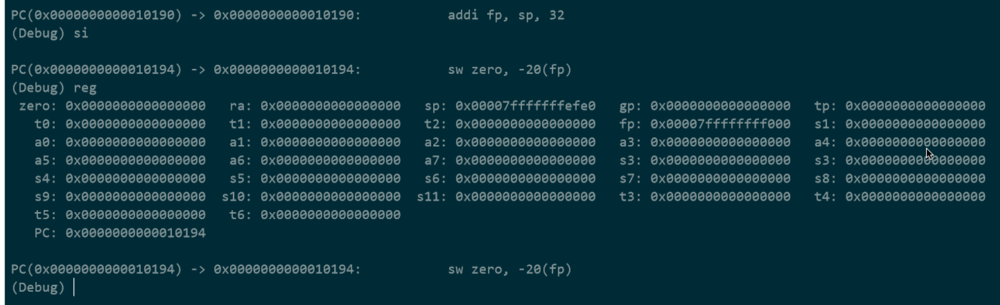
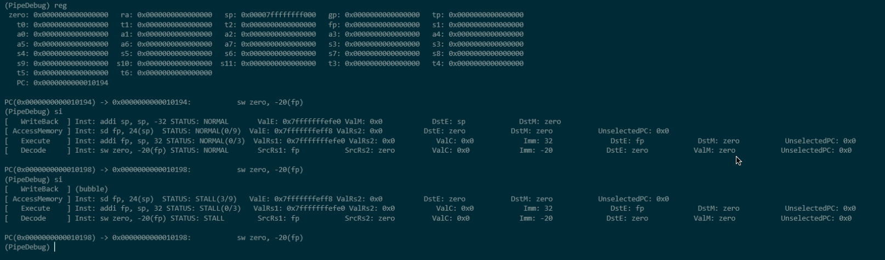

# 计算机组织与体系结构实习 Lab 2: RISV-Simulator

1700012751 麦景

[TOC]

*<mark>Note</mark>: 本次lab的完整源代码和部分文档托管在[此](https://github.com/magic3007/RISCV-Simulator), 为避免重复, 其中README.md的内容会被引用作为本报告的一部分.*

## 实验(开发)环境

以下toolchains配置均在操作系统Ubuntu18.04下进行. 在本次lab中, 我们使用了`SiFive` 提供的[prebuilt RISC-V GCC toolchain](https://www.sifive.com/boards), 同时我们需要如下的编译指示:

- `-Wa,-march=rv64im`: compulsorily compile the source file into RV64I executable file
- `-static`: statically linking
- `-Wl,--no-relax`: To start running from `main`, we have to forbid the compiler to leverage the global pointer to optimize

由于这个prebuilt的toolchain中的库函数含有16-bit的压缩后的指令, 因此我们的simulator从函数`main`开始执行, 更多关于交叉编译RISC-V二进制文件的使用方法见[此](https://github.com/magic3007/RISCV-Simulator/blob/master/README.md#how-to-compile-your-customized-c-source-codes-into-risc-v-executable-file).

## 设计概述

本次lab实现的simulator用Go语言实现, 且同时支持模拟*RV64I*指令集和*RV64M*指令集. 此simulator支持两种模式: single-instruction mode和pipeline mode, 分别对应于lab要求中的功能模拟和性能模拟. 此simulator主要具有两大sparkle points

- 利用数据驱动编程的思想, 各指令的特性可自由配置, 相关的配置信息在表[src/action_table.csv](./https://github.com/magic3007/RISCV-Simulator/blob/master/src/action_table.csv)中, 这里总结出可配置特性及其给表格中对应的列, 相关列的含义将在下面的section中给出.

  | 配置特性                                    | 相关列                                               |
  | ------------------------------------------- | ---------------------------------------------------- |
  | 指令类型的识别与解析                        | `Type`, `Opcode`, `Funct3` `Funct7`  `BitConstraint` |
  | 指令显示格式                                | `DisplayFormat`                                      |
  | 指令行为(single-instruction mode)           | `Action1` `Action2`                                  |
  | 指令跳转识别信号(pipeline mode)             | `IsBranch` `IsIndirectJump`                          |
  | 执行阶段行为(pipeline mode)                 | `ALUFunction`                                        |
  | 访存阶段行为(pipeline mode)                 | `MemoryAccessFunction`                               |
  | PC相关的计算行为(pipeline mode)             | `ValCFunction` `PositiveOptionPC` `NegativeOptionPC` |
  | 执行结果和访存结果目标寄存器(pipeline mode) | `dstE` `dstM`                                        |
  | 执行结果寄存器选择来源(pipeline mode)       | `M_valE_Source`                                      |
  | 执行阶段时延                                | `EStagePeriod`                                       |
  | 访存阶段时延                                | `MStagePeriod`                                       |

- 提供了类似`gdb` 的交互模式, 便于调试, 查看寄存器和内存信息.

## 具体设计和实现

### 存储接口

simulator的存储接口主要包括两部分, 分别是寄存器和内存, 分别被封装在`package register`和`package memory`内部. `package memory`主要是对64位虚拟内存空间进行管理.

### 可执行文件的读取和装载

可执行文件的读取主要利用了Go语言标准库提供的包[debug/elf](https://golang.org/pkg/debug/elf/). 在运行simulator时, 可通过命令行参数`-v`选择是否显示ELF File Header的信息:

```bash
$ ./bin/sim -f testcases/add.out -v=1
FileHeader
Class          : ELFCLASS64
Data           : ELFDATA2LSB
Version        : EV_CURRENT
OSABI          : ELFOSABI_NONE
ABIVersion     : 0
ByteOrder      : LittleEndian
Type           : ET_EXEC
Machine        : EM_RISCV
Entry          : 0x00000000000100cc
Sections       : [0xc0000ee000 0xc0000ee080 0xc0000ee100 0xc0000ee180 0xc0000ee200 0xc0000ee280 0xc0000ee300 0xc0000ee380 0xc0000ee400 0xc0000ee480 0xc0000ee500 0xc0000ee580 0xc0000ee600 0xc0000ee680 0xc0000ee700 0xc0000ee780 0xc0000ee800 0xc0000ee880 0xc0000ee900]
Progs          : [0xc0000ba1e0 0xc0000ba240]
closer         : 0xc0000b8018
gnuNeed        : []
gnuVersym      : []
===========================================
Porgram 0:
ProgHeader
Type           : PT_LOAD
Flags          : PF_X+PF_R
Off            : 0x0000000000000000
Vaddr          : 0x0000000000010000
Paddr          : 0x0000000000010000
Filesz         : 0x000000000000056e
Memsz          : 0x000000000000056e
Align          : 0x0000000000001000
ReaderAt       : 0xc000098360
sr             : &{0xc0000b8018 0 0 1390}
===========================================
Porgram 1:
ProgHeader
Type           : PT_LOAD
Flags          : PF_W+PF_R
Off            : 0x0000000000000570
Vaddr          : 0x0000000000011570
Paddr          : 0x0000000000011570
Filesz         : 0x00000000000007a8
Memsz          : 0x00000000000007e0
Align          : 0x0000000000001000
ReaderAt       : 0xc000098390
sr             : &{0xc0000b8018 1392 1392 3352}
```

ELF 文件中的program, section和segment的区别和联系如下:

> program, section & segment in ELF File

program table: optional in linking view

section table: optional in execution view



因此对于可执行文件, 我们只需要关注program, 把各program加载到对应的内存位置即可.

### 初始化

程序正式运行前的初始化主要包括如下部分:

- 栈空间的分配和栈顶指针的初始化

  由于栈的位置和大小并不由ELF文件自身规定, 我们采用OS中常用的`0x7ffffffff000`作为栈顶`STACK_TOP`, 同时默认分配`STACK_SIZE`为4M的栈空间.

- 程序entry的设置

  由于prebuilt的toolchain中的库函数含有16-bit的压缩指令, 因此我们的simulator从函数`main`开始执行

### 指令语义的解析

正如前面所说, 指令语义的解析主要是通过[src/action_table.csv](./https://github.com/magic3007/RISCV-Simulator/blob/master/src/action_table.csv)中的配置进行的, 其中与指令语义解析相关的列有 `Type`, `Opcode`, `Funct3`, `Funct7` 和 `BitConstraint`.



其中的`Type` 与 [The RISC-V Instruction Set Manual](https://content.riscv.org/wp-content/uploads/2017/05/riscv-spec-v2.2.pdf) 中对指令分类相同:



`Opcode`, `Funct3`, `Funct7` 则分别代表各个类型指令对应的部分的限制. 除此以外, 部分指令如`SLLI`, `SRLI` 和 `SRAI` 等, 会对其他部分有限制, 我们通过`BitConstraint`限制.



通过如上的方式识别指令类型后, 我们就可以很方便地提取出各指令中的`rd`, `rs1`, `rs2` `imm`等部分, 从而完成指令语义的解析.

指令对应的操作我们也可以在[src/action_table.csv](./https://github.com/magic3007/RISCV-Simulator/blob/master/src/action_table.csv)中进行配置, 在single-instruction mode中与此相关的是列是`Action1`和`Action2`. 在pipeline mode中的操作配置见下面的section.


除此以外, 我们为了模拟`gdb`, 还可以对各指令的Display Format进行配置. Assembly Language的显示格式主要有以下五种:

| Display Format | Example             |
| -------------- | ------------------- |
| DSS            | `add rd, rs1, rs2`  |
| DIS            | `lb rd, imm(rs1)`   |
| DSI            | `xori rd, rs1, imm` |
| SIS            | `sb rs2, imm(rs1)`  |
| DI             | `auipc rd, imm`     |

同样地, 我们在[src/action_table.csv](./https://github.com/magic3007/RISCV-Simulator/blob/master/src/action_table.csv)中进行配置, 从而可以非常方便地输出易于解读的汇编指令, 显示效果见下面的section.

### 控制信号的处理

控制信号主要用在pipeline mode下. 此simulator运行五级流水线,其设计如下:

在真实的数字电路设计中, 

### 性能计数相关模块的处理

性能计数比较方便, 只需要在程序特定的位置使用计数器即可. 目前提供的性能计数指标主要为下面的[section](#功能测试和性能评测)服务.

### 调试接口

由于本simulator本身就提供类似于`gdb`的交互模式, 故调试接口是天然的. 在调试模式下, 该simulator支持如下类似于`gdb`的操作:

-  `c`: Continue running until the program comes to the end
-  `reg`: Display register information
-  `info`: Display the address of this symbol defined in ELF file
-  `si`: In single-instruction mode, the function of this operations is the same as that of `gdb`, namely running a single machine instruction. However, in pipeline mode, it means running a single pipeline stage.
-  ` x/<length><format> [address]`: Display the memory contents at a given address using the specified format.

- `status`(only in pipeline mode): Display the status of each pipeline register.

*<mark>Note</mark>: Operation `si` has different function in single-instruction mode and pipeline mode. We will explain why we have such design in the following section.*


下面是分别single-instruction mode和pipeline mode的调试过程的截图, 查看调试过程的动图见[此](https://github.com/magic3007/RISCV-Simulator/blob/master/README.md#how-to-compile-your-customized-c-source-codes-into-risc-v-executable-file).





## 功能测试和性能评测

(分析)

## Summary

总的来说, 该模拟器提供了如下的功能特性:

- 提供了类似于`gdb`的交互模式, 支持单指令模拟和流水线模拟.
- 利用数据驱动编程的思想, 指令可自由配置, 这为拓展新的指令集提供了方便手段.
- 在流水线模式下, 流水线的步近周期, 指令执行周期等均可自由配置, 同时为接下来对存储的访问延时预留了接口.

更多关于此simulator的使用方式见[此](https://github.com/magic3007/RISCV-Simulator).😜