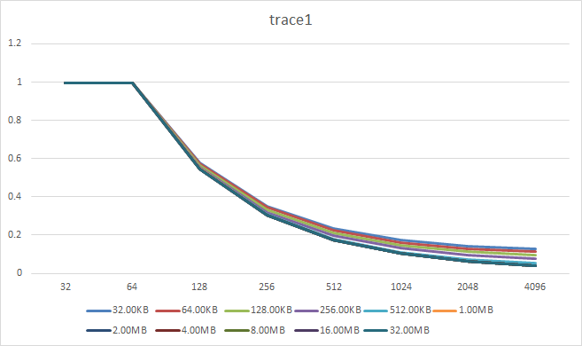
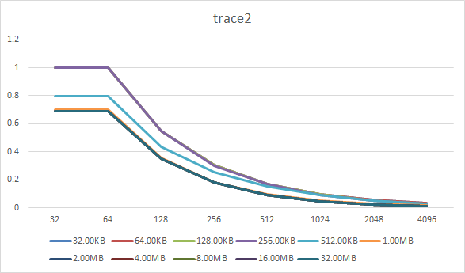
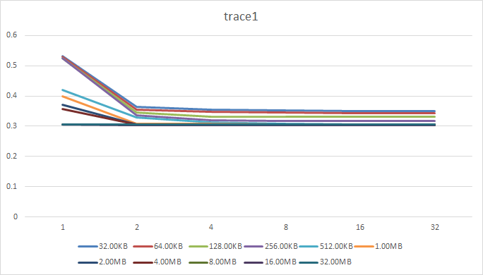
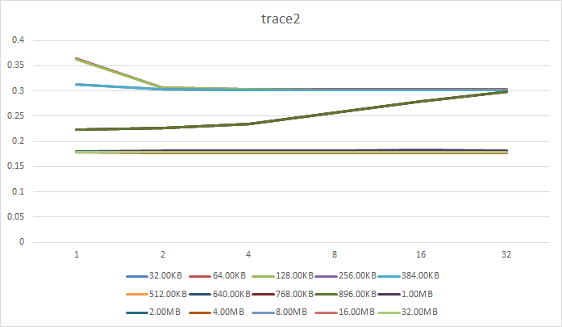

# 计算机组织与体系结构实习 Lab 3: Cache Simulator

1700012751 麦景

[TOC]

_Note: 代码和使用方法见 https://github.com/magic3007/RISCV-Simulator._

##          单级Cache模拟

> 保持associativity为8, 在不同的Cache Size(32KB ~ 32MB)的条件下, Miss Rate随Block Size(32B, 64B, 128B, 256B, 512B, 1024B, 2048B, 4096B)的变化趋势如下.

分析:

- Cache Size不变时, 随着Block Size变大, Miss Rate变小
- 在相同Block Size的条件下, Cache Size越大, Miss Rate越小
- 在Block Size在64B ~ 256B的时候, Miss Rate随Cache Size变大下降较快, 256B后下降速度减弱
- 同时这两条曲线有一些微妙的差别. trace1的各条曲线在左侧聚合, trace2的各条曲线在右边聚合. 这原因是trace2的空间局部性更差, 当Block Size较小时, Cache Size上升带来的Miss Rate下降程度越大. 

>  保持Block Size为256B, 在不同的Cache Size(32KB ~ 32MB)的条件下, Miss Rate随associativity(1,2,4,8,16)的变化趋势如下.

分析:
- 对于trace1和trace2, 随着associativity增加,  总体上Miss Rate均下降, 但是当associativity超过2之后Miss Rate下降趋势不明显
- 当associativity不变, 随着cache size增大, miss Rate下降. 但是这两个trace有各自特点
  - 对trace1来说, cache size在32KB ~ 256KB时miss Rate下降不明显; 在512KB ~ 32MB之间miss rate下降迅速, 并且在cache size为32MB的时候, 基本达到了下限.
  - 对trace2来说, 其miss rate大致分布为三个部分
    - cache size为32KB ~ 384KB时, miss rate大致都在0.3 ~ 0.36
    - cache size为1MB ~ 32MB时, miss rate基本相同, 且达到下界0.17附近
    - cache size为512KB-986KB时, miss rate处于前两者之间, 且曲线基本重合, 即在256KB ~ 1MB之间miss rate存在一个较大的gap; 同时此时Miss Rate随associativity的变化较为反常, 随着associativity增加,  Miss Rate上升.
>  在如下配置进行测试, Write Through 和 Write Back、 Write Allocate 和 No-write Allocate 的总访问延时如下(数据分别见[policy.trace1.csv](./policy.trace1.csv)和[policy.trace2.csv](./policy.trace2.csv))

| configuration                   |       |
| ------------------------------- | ----- |
| cache hit latency (cycle)       | 1     |
| main memory hit latency (cycle) | 10    |
| Block Size                      | 256B  |
| Associativity                   | 8     |
| Cache Size                      | 512KB |

_trace1_:

| WriteUpPolicy | WriteDownPolicy   | Miss Rate | AMAT  |
| ------------- | ----------------- | --------- | ----- |
| Write Back    | Write Allocate    | 0.308     | 4.542 |
| Write Back    | No-write Allocate | 0.6497    | 7.497 |
| Write Through | Write Allocate    | 0.308     | 7.576 |
| Write Through | No-write Allocate | 0.6497    | 7.52  |

_trace2_:

| WriteUpPolicy | WriteDownPolicy   | Miss Rate | AMAT     |
| ------------- | ----------------- | --------- | -------- |
| Write Back    | Write Allocate    | 0.256427  | 4.745616 |
| Write Back    | No-write Allocate | 0.61565   | 7.156497 |
| Write Through | Write Allocate    | 0.256427  | 7.036349 |
| Write Through | No-write Allocate | 0.61565   | 7.156497 |

分析:

- 对于trace1和trace2, 均为采取Write Back+Write Allocate的组合AMAT和Miss Rate最小
- 在单级缓存中, 采取Write Allocate策略比采取No-write Allocate策略Miss Rate更小

## 与lab2中的CPU模拟器联调完成模拟

与Lab2中的流水线模拟器联调，运行测试程序。该测试中cache和Main Memory的配置如下, 并且假设执行阶段可以一个步进周期内完成, 同时由于程序代码本身比较小, 这里仅考虑Data Cache. 

| Level       | Capacity | Associativity | Line Size(Bytes) | WriteUp Policy | WriteBack Policy | Hit Latency |
| ----------- | -------- | ------------- | ---------------- | -------------- | ---------------- | ----------- |
| L1          | 32KB     | 8             | 64               | write back     | write allocate   | 1           |
| L2          | 256KB    | 8             | 64               | write back     | write allocate   | 8           |
| LLC         | 8MB      | 8             | 64               | write back     | write allocate   | 20          |
| Main Mamory | 1GB      | -             | -                | -              | -                | 40          |

不使用cache, cpu直接访问main memory其结果如下:

|                 | number of Cycles | number of Valid Instructions | CPI      | Jump Prediction Success Rate | number of Indirect Jump | Stall for Data Hazard |
| --------------- | ----------- | ----------------------- | -------- | ---------------------------- | ------------------ | --------------------- |
| add             | 2359 | 232                     | 10.16810 | 83.33333%                    | 1                  | 52                    |
| mul-div         | 2384 | 257                     | 9.27626 | 83.33333%                    | 1                  | 52                    |
| n!              | 2331 | 268                     | 8.69776 | 90.00000%                    | 21                 | 28                    |
| qsort           | 270635 | 19184                   | 14.10733 | 51.53639%                    | 159                | 3204                  |
| simple-function | 2452 | 243                     | 10.09054 | 83.33333%                    | 3                  | 52                    |

使用如上配置的cache的结果如下:

|                 | number of Cycles | number of Valid Instructions | CPI      | L1 Miss Rate | AMAT |
| --------------- | ----------- | ----------------------- | -------- | ---------------------------- | --------------------- |
| add             | 455 | 232                     | 1.96121 | 0.011931            | 1.811280            |
| mul-div         | 480 | 257                     | 1.86770 | 0.011638            | 1.791367            |
| n!              | 583 | 268                     | 2.17537 | 0.012155            | 1.826535            |
| qsort           | 44079 | 19184                   | 2.29770 | 0.000782 | 1.053147 |
| simple-function | 484 | 243                     | 1.99177 | 0.011638            | 1.791367            |

我们可以看到, 由于这几个程序访问的数据内存范围较小, 有较好的空间局部性和时间局部性, 极大地减少了CPI.

## 高速缓存管理策略优化

在如下默认配置下, _cacti6.5_的模拟结果为(假设CPU主频为2.0GHz, 即1 cpu cycle=0.5ns):

|                   | WriteUp Policy | WriteBack  Policy | Technology size (nm) | Capacity | Associativity | Block Size(Bytes) | Hit Latency(ns) | Cycle |
| ----------------- | -------------- | ----------------- | -------------------- | -------- | ------------- | ----------------- | --------------- | ----- |
| L1 Cache          | write back     | write allocate    | 32                   | 32KB     | 8             | 64                | 0.468579        | 1     |
| L2 Cache          | write back     | write allocate    | 32                   | 256KB    | 8             | 64                | 0.673308        | 2     |
| LCC Cache         | write back     | write allocate    | 32                   | 8MB      | 8             | 64                | 1.66275         | 4     |
| Main Memory(DRAM) | -              | -                 | 68                   | 1GB      | 1             | 64                | 12.8821         | 26    |

在该默认配置下, 用模拟器运行trace2017中的两个trace结果如下:
|                  | 01-mcf-gem5-xcg | 02-stream-gem5-xaa |
| ---------------- | --------------- | ------------------ |
| L1 Miss Rate     | 0.200455        | 0.113404           |
| L2 Miss Rate     | 0.396293        | 0.755171           |
| L3 Miss Rate     | 0.303580        | 0.799801           |
| AMAT (cpu cycle) | 2.751130        | 4.815993           |

> 请填写最终确定的优化方案，并陈述理由。对于涉及到的算法，需要详细描述算法设计和实现思路，并给出优缺点分析。

- LFU(Least Frequently Used): 与LRU类似, 但是每次选择访问频率最小的数据被淘汰
  - pros: 高效, 对热点内容效果较好
  - cons: 算法复杂, 用硬件实现比较困难
- cache prefetching: 当预测到将连续访问连续内存地址的时候, 预先后面的内容
  - pros: 能利用预测信息减少访存时间, 其中instruction prefetching尤为常用.
  - cons: 预测错误会增大开销

在该优化配置下, 用模拟器运行trace2017中的两个trace结果如下:
|              | 01-mcf-gem5-xcg | 02-stream-gem5-xaa |
| ------------ | --------------- | ------------------ |
| L1 Miss Rate | 0.181500        | 0.113404           |
| L2 Miss Rate | 0.347836        | 0.755253           |
| L3 Miss Rate | 0.444222        | 0.887442           |
| AMAT (ns)    | 2.542618        | 4.759982           |

可以看到, 这两个trace的AMAT均有大幅下降.
