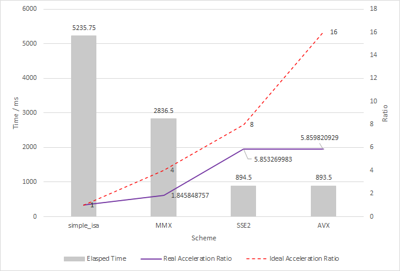
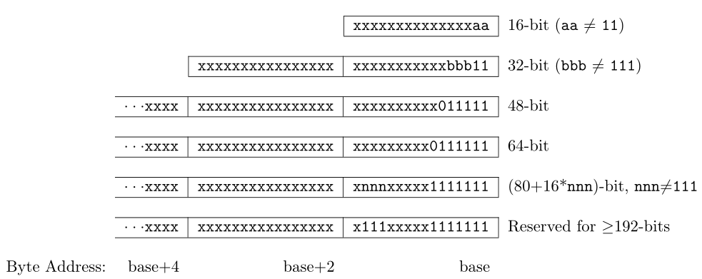
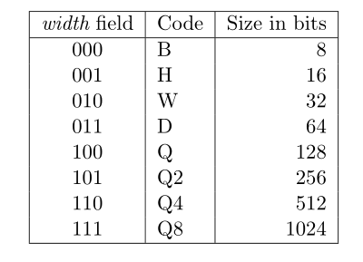

# 计算机组织与体系结构实习 Lab 4:  Architecture Optimization For Specific Application 

1700012751 麦景

[TOC]

## 使用x86 SIMD指令对应用程序进行优化并分析

> 1. 读入一幅YUV420格式的图像.
> 2. YUV420到ARGB8888转换(Alpha 分别取1~255，for(A=1;A<255;A=A+3)，共85幅图像).
> 3. 根据A计算alpha混合后的RGB值（A*RGB/256）,得到不同亮度的alpha混合.
>
> 4)   将alpha混合后的图像转换成YUV420格式，保存输出文件.
>
> 然后分别使用x86-64的基础ISA、MMX、SSE2、AVX编写图像处理基准程序，记录运行时间并进行简要分析.

### Usage

源码见https://github.com/magic3007/intel-simd.

运行方式如下:

```bash
mkdir build && cd build
cmake -DCMAKE_BUILD_TYPE=Release ..
make -j8

./demo --help
# Convert YUV420 file to RGB
# Usage: ./demo [OPTIONS]
# 
#Options:
#  -h,--help                   Print this help message and exit
#  -f TEXT REQUIRED            Input YUV420 file
#  -s BOOLEAN                  Whether to dump the output

./demo -f ../testcases/dem1.yuv
```

通过设置命令行参数`-s`, 可以避免磁盘IO对运行时间的测量带来影响. 同时为了获得稳定的测量结果, 我们将令alpha遍历0 ~ 254, 进行255次如下的转换操作:

```c++
void do_work(Impl &impl, YUV420 *yuv_src, YUV420 *yuv_dst, RGB *rgb,
             uint8_t alpha){
  impl.YUV2RGB(yuv_src, rgb);
  impl.AlphaBlend(rgb, alpha);
  impl.RGB2YUV(rgb, yuv_dst);
}
```

### Simple ISA实现

每次调用`do_work`函数都会完成如下三项工作:

- YUV图像到RGB图像的转换
- 设置GRB图像透明度
- RGB图像到YUV图像的转换

转换方式我们使用了[wikipedia](https://en.wikipedia.org/wiki/YUV)上使用整数运算的方案, 核心函数如下. 向量化方案亦使用相同的转换方式.

```c++
void ImplSimple::YUV2RGB(YUV420 *yuv, RGB *rgb) {
  assert(yuv->height_ == rgb->height_);
  assert(yuv->width_ == rgb->width_);

  auto y = yuv->y_;
  auto u = yuv->u_;
  auto v = yuv->v_;
  auto r = rgb->r_;
  auto g = rgb->g_;
  auto b = rgb->b_;

  for(size_t i = 0; i < yuv->size_; ++i){
    int c = y[i] - 16;
    int d = u[i] - 128;
    int e = v[i] - 128;
    r[i] = clamp((298 * c + 409 * e + 128) >> 8);
    g[i] = clamp((298 * c - 100 * d - 208 * e + 128) >> 8);
    b[i] = clamp((298 * c + 516 * d + 128) >> 8);
  }

}
```
```c++
void ImplSimple::AlphaBlend(RGB *rgb, uint8_t alpha) {
  auto r = rgb->r_;
  auto g = rgb->g_;
  auto b = rgb->b_;
  for(size_t i = 0; i < rgb->size_; i++){
    r[i] = (uint32_t)alpha * r[i] >> 8;
    g[i] = (uint32_t)alpha * g[i] >> 8;
    b[i] = (uint32_t)alpha * b[i] >> 8;
  }
}
```


```c++
void ImplSimple::RGB2YUV(RGB *rgb, YUV420 *yuv) {
  assert(yuv->height_ == rgb->height_);
  assert(yuv->width_ == rgb->width_);

  auto y = yuv->y_;
  auto u = yuv->u_;
  auto v = yuv->v_;
  auto r = rgb->r_;
  auto g = rgb->g_;
  auto b = rgb->b_;

  for(size_t i = 0; i < rgb->size_; i++){
    int c = r[i];
    int d = g[i];
    int e = b[i];
    y[i] = clamp(((66 * c + 129 * d + 25 * e + 128) >> 8) + 16);
    u[i] = clamp(((-38 * c - 74 * d + 112 * e + 128) >> 8) + 128);
    v[i] = clamp(((112 * c - 94 * d - 18 * e + 128) >> 8) + 128);
  }

}
```

### Vectorization Scheme

Vectorization scheme亦使用相同的转换方式, 以YUV图像到RGB图像的转换为例, 我们通过template的方式可以得到关于vectorization scheme的通用计算方式, 我们对于各个vectorization scheme, 只需要实现加法, 减法, 乘法, 右移, 存取内存即可.

```c++
template <class SIMD>
void ImplSimd<SIMD>::YUV2RGB(YUV420 *yuv, RGB *rgb) {
  assert(yuv->height_ == rgb->height_);
  assert(yuv->width_ == rgb->width_);
  assert(yuv->size_ % kStride == 0);

  auto y = yuv->y_;
  auto u = yuv->u_;
  auto v = yuv->v_;
  auto r = rgb->r_;
  auto g = rgb->g_;
  auto b = rgb->b_;

  for(size_t i = 0; i < yuv->size_; i += kStride){
    Vector c = sub(load(y+i), cn(16));
    Vector d = sub(load(u+i), cn(128));
    Vector e = sub(load(v+i), cn(128));

    /*
    r[i] = clamp((298 * c + 409 * e + 128) >> 8);
    g[i] = clamp((298 * c - 100 * d - 208 * e + 128) >> 8);
    b[i] = clamp((298 * c + 516 * d + 128) >> 8);
     */
    store(rli(add(add(mul(cn(298),c),mul(cn(409),e)),cn(128)), 8), r + i);
    store(rli(add(sub(sub(mul(cn(298),c),mul(cn(100),d)),mul(cn(208),e)), cn(128)), 8), g + i);
    store(rli(add(add(mul(cn(298),c),mul(cn(516),d)),cn(128)), 8), b + i);
    SIMD::Empty();
  }
}
```

我们可以通过[Intel Intrinsic 接口](https://software.intel.com/sites/landingpage/IntrinsicsGuide/)非常方便地实现该功能, 此project用到的部分接口如下:

|                | MMX                      | SSE2                     | AVX                      |
| -------------- | ------------------------ | ------------------------ | ------------------------ |
| header file    | `#include <emmintrin.h>` | `#include <emmintrin.h>` | `#include <immintrin.h>` |
| 清零           | `_mm_setzero_si64`       | `_mm_setzero_si128`      | `_mm256_setzero_si256`   |
| 设置常数       | `_mm_set1_pi16`          | `_mm_set1_epi16`         | `_mm256_set1_epi16`      |
| 16位加法       | `_mm_add_pi16`           | `_mm_add_epi16`          | `_mm256_add_epi16`       |
| 16位减法       | `_mm_sub_pi16`           | `_mm_sub_epi16`          | `_mm256_sub_epi16`       |
| 16位乘法(低位) | `_mm_mullo_pi16`         | `_mm_mullo_epi16`        | `_mm256_mullo_epi16`     |
| 16位算术右移   | `_mm_srai_pi16`          | `_mm_srai_epi16`         | `_mm256_srai_epi16`      |
| 解包           | `_mm_unpacklo_pi8`       | `_mm_unpacklo_epi8`      |                          |
| 打包           | `_mm_packs_pi16`         | `_mm_packs_epi16`        | `_mm256_packs_epi16`     |
| 读内存         |                          | `_mm_loadl_epi64`        |                          |
| 写内存         |                          | `_mm_storel_epi64`       |                          |
| 转换为整数     | `_m_to_int`              |                          |                          |

### 实验结果与分析

以下实验数据在_WSL Ubuntu 18.04_下测量4次得到, 处理器为_Intel(R) Core(TM) i7-7700HQ CPU @ 2.80GHz_, 编译器为_g++ (Ubuntu 7.5.0-3ubuntu1~18.04) 7.5.0_.



在向量化方案中, 我们使用16位整数进行运行, 得到上图中的理想加速比, 即红色虚线; 以及我们真实结果得到的加速比, 即紫色实线. 通过分析我们可以得到如下结论

- MMX相比于simple ISA有约1.8倍的提升, 但远小于4倍的理想加速比, 我认为是MMX与SSE2和AVX不同, 缺乏直接存取内存的intrinsic接口.
- SSE2相比于simple ISA有约5.6倍的提升,与理想加速比比较接近, 并且相比于MMX, 其真实加速比曲线与理想加速比曲线基本平行.
- AVX与SSE2加速比基本相当, 我认为这与本代码的实现方式相关. 实际上, 在本测试平台上, AVX不支持部分特定形式的存取intrinsic接口, 且部分intrinsic接口在本测试平台上并不存在, 因此在AVX的存取寄存器实现中我们本代码使用了部分SSE2的存取intrinsic接口, 故这部分成为了事实上的bottleneck.


## 设计自定义扩展指令对SIMD应用优化并分析

> 1. 设计若干32位宽的扩展指令
>    - 支持8个宽度为256位的SIMD指令专用寄存器
>    - 支持8/16/32位pack、unpack计算
>    - 支持加/减/乘法
>    - 支持饱和计算
>    - 支持必要的数据传输指令
> 2. 可参考RISCV指令设计格式SIMD指令扩展编码，可自行设计汇编助记符。在文档里要写明自己设计指令的编码，助记符，以及指令语义。

8个宽度为256位的SIMD指令专用寄存器分别标号为`v0` - `v7`.

汇编助记符分为三个部分, 以`_v_adds_pi16`为例进行解释:

- `v` 表示SIMD拓展指令. 

- `add`表示加法运算, 类似地, 可以定义运算`sub`, `mul`, `pack`, `unpack`, `load`, `store`, `setzero`, `set1`, `rli`等. 打包和解包的含义除此以外, 我们还可以定义后缀
- `s` 表示饱和运算, 故例子的`addus`表示无符号饱和加法
  - `lo`和`hi`分别表示低位和高位. 如`_v_mullo_pi16`表示16位有符号数乘法, 结果保存低位.
  - 对于`load`和`store`, 可支持非对齐地址

- `pi16` 中的`pi` 表示有符号, `16`表示16位整数, 除此以外, 我们可以进一步推广到8位和32位整数及其有无符号运算(`pu`)

而对于三元操作`op $reg0, $reg1, $reg2`, 其操作数顺序作如下规定: `$reg0`是目标数, 且 `$reg0 = $reg1 op $reg2`.

  一些汇编助记符的例子如下, 其他可以类似推广得到:

| Assembly Language                     | Remark                                                       |
| ------------------------------------- | ------------------------------------------------------------ |
| `_v_adds_pu32 $reg0, $reg1, $reg2`    | 32位无符号整数饱和加法                                       |
| `_v_mullo_pu16 $reg0, $reg1, $reg2`   | 16位无符号整数乘法, 且结果保留低位                           |
| `_v_packs_pu8 $reg0, $reg1, $reg2`    | 8位无符号整数饱和打包                                        |
| `_v_unpacklo_pi8 $reg0, $reg1, $reg2` | 将`$reg1`和`$reg2`的低位部分以8位为单位进行解包              |
| `_v_load_pi32 $reg0, $rs1`            | 将寄存器`$rs1`指向的内存以32位有符号整数为单位加载入SIMD指令专用寄存器, |
| `_v_store_pi32 $reg0, $rs1`           | 将SIMD指令专用寄存器以32位有符号整数为单位加写回寄存器`$rs1`指向的内存 |
| `_v_set1_pi32 $reg0, imm`             | 将`$reg0`以32位有符号整数为单位设置成立即数`imm`             |
| `_v_setzero $reg0`                    | 将`$reg0`清零                                                |

  参考RISC-V的"P" Standard Extension, 我们可以如下设计指令编码:

类似于RISC-V 32I, 我们可以R型指令(寄存器之间的运算, 如`_v_adds_pu32 $reg0, $reg1, $reg2`),S型指令(存取内存指令, 如`_v_load_pi32 $reg0, $rs1`)和I型指令(如`_v_set1_pi32 $reg0, imm`).

指令长度编码与RISC-V的规定相同, 由于这里使用32位指令, 即使用下图的第二行:



对于R型指令

| Field     | funct9   | vrs2          | i/u        | sta            | vrs1          | width      | funct2   | vrd        | opcode |
| --------- | -------- | ------------- | ---------- | -------------- | ------------- | ---------- | -------- | ---------- | ------ |
| Bit Range | 31-23    | 22-20         | 19         | 18             | 17-15         | 14-12      | 11-10    | 9-7        | 6-0    |
| Remark    | 功能指示 | 源向量寄存器2 | 是否有符号 | 是否为饱和运算 | 源向量寄存器1 | 操作数宽度 | 功能指示 | 目标寄存器 | 操作码 |

- 我们可以指定任意与RISC-V RV32I不冲突的opcode作为指示SIMD的拓展指令.

- 操作数宽度的设置与RISC-V "P" standard extension相同



对于S型指令

| Field     | funct10  | rs1       | width      | funct2   | vrd            | opcode |
| --------- | -------- | --------- | ---------- | -------- | -------------- | ------ |
| Bit Range | 31-20    | 19-15     | 14-12      | 11-10    | 9-7            | 6-0    |
| Remark    | 功能指示 | 源寄存器1 | 操作数宽度 | 功能指示 | 目标向量寄存器 | 操作码 |

对于I型指令

| Field     | imm[11:0] | funct11  | width      | funct2   | vrd            | opcode |
| --------- | --------- | -------- | ---------- | -------- | -------------- | ------ |
| Bit Range | 31-20     | 19-15    | 14-12      | 11-10    | 9-7            | 6-0    |
| Remark    | 立即数    | 功能指示 | 操作数宽度 | 功能指示 | 目标向量寄存器 | 操作码 |

> 3. 采用设计的SIMD扩展指令，重新编写lab4中的图像计算核心函数，并在文档中给出该核心函数的相应代码.

C++版本的图像计算核心代码如下, SIMD指令专用寄存器位数为256, 操作数宽度为16, 下图中的`kStride`为256/16=16.

```c++
  auto y = yuv->y_;
  auto u = yuv->u_;
  auto v = yuv->v_;
  auto r = rgb->r_;
  auto g = rgb->g_;
  auto b = rgb->b_;

  for(int i = 0; i < yuv->size_; i += kStride){
    Vector c = load(r+i);
    Vector d = load(g+i);
    Vector e = load(b+i);

    /*
    y[i] = clamp(((66 * c + 129 * d + 25 * e + 128) >> 8) + 16);
    u[i] = clamp(((-38 * c - 74 * d + 112 * e + 128) >> 8) + 128);
    v[i] = clamp(((112 * c - 94 * d - 18 * e + 128) >> 8) + 128);
     */
    store(add(rli(add(add(add(mul(cn(66),c), mul(cn(129), d)), mul(cn(25), e)), cn(128)),8), cn(16)), y+i);
    store(add(rli(add(sub(sub(mul(cn(112),e), mul(cn(38), c)), mul(cn(74), d)), cn(128)),8), cn(128)), u+i);
    store(add(rli(add(sub(sub(mul(cn(112),c), mul(cn(94), d)), mul(cn(18), e)), cn(128)),8), cn(128)), v+i);
}
```

翻译得到的汇编代码如下

```assembly
# auto y = yuv->y_
# auto u = yuv->u_
# auto v = yuv->v_
# auto r = rgb->r_
# auto g = rgb->g_
# auto b = rgb->b_
# 假设通用寄存器$a1-$a6已经分别存放着数组y, u, v, r, g, b的首地址; $a7 已经存放着 yuv->size_
# kStride为16, 由编译时决定

xor $t1, $t1, $t1 # i = 0
loop:	
	_v_setzero	$v7
	
	# Vector c = load(r+i)
	addiw $t2, $a4, $t1
	_v_load_pi128 $v0, $t2
	_v_unpacklo_pi8 $v0, $v0, $v7
	
	# Vector d = load(g+i)
	addiw $t2, $a5, $t1
	_v_load_pi128 $v1, $t2
	_v_unpacklo_pi8 $v1, $v1, $v7
	
	# Vector e = load(b+i)
	addiw $t2, $a6, $t1
	_v_load_pi128 $v2, $t2
	_v_unpacklo_pi8 $v2, $v2, $v7
	
	# =========================================================
	# store(add(rli(add(add(add(mul(cn(66),c), mul(cn(129), d)), mul(cn(25), e)), cn(128)),8), cn(16)), y+i)
	# =========================================================
	
	# mul(cn(66),c)
	_v_set1_pi16 $v7, 66 
	_v_mullo_pi16 $v3, $v0, $v7
	# mul(cn(129), d)
	_v_set1_pi16 $v7, 129
	_v_mullo_pi16 $v4, $v1, $v7
    # mul(cn(25), e)
    _v_set1_pi16 $v7, 25
	_v_mullo_pi16 $v5, $v2, $v7
	# add(add(add(mul(cn(66),c), mul(cn(129), d)), mul(cn(25), e)),cn(128))
	_v_add_pi16 $v3, $v3, $v4
	_v_add_pi16 $v3, $v3, $v5
	_v_set1_pi16 $v7, 128
	_v_add_pi16 $v3, $v3, $v7
	
	# rli(add(add(add(mul(cn(66),c), mul(cn(129), d)), mul(cn(25), e)), cn(128)),8)
	_v_rli_pi16 $v3, $v3, 8
	
    # add(rli(add(add(add(mul(cn(66),c), mul(cn(129), d)), mul(cn(25), e)), cn(128)),8), cn(16))
    _v_set1_pi16 $v7, 16
    _v_add_pi16 $v3, $v3, $v7
    
    # store
    _v_setzero	$v7
    _v_packs_pi16 $v3, $v3, $v7
    _v_store_pi128 $v3, $v3, $a1
    
    # =========================================================
    # store(add(rli(add(sub(sub(mul(cn(112),e), mul(cn(38), c)), mul(cn(74), d)), cn(128)),8), cn(128)), u+i)
    # =========================================================
    
	# mul(cn(38),c)
	_v_set1_pi16 $v7, 38 
	_v_mullo_pi16 $v3, $v0, $v7
	# mul(cn(74), d)
	_v_set1_pi16 $v7, 129
	_v_mullo_pi16 $v4, $v1, $v7
    # mul(cn(112), e)
    _v_set1_pi16 $v7, 25
	_v_mullo_pi16 $v5, $v2, $v7
	# add(sub(sub(mul(cn(112),e), mul(cn(38), c)), mul(cn(74), d)), cn(128))
	_v_sub_pi16 $v5, $v5, $v4
	_v_sub_pi16 $v5, $v5, $v3
	_v_set1_pi16 $v7, 128
	_v_add_pi16 $v3, $v5, $v7
	
	# rli
	_v_rli_pi16 $v3, $v3, 8
	
	# add 
    _v_set1_pi16 $v7, 128
    _v_add_pi16 $v3, $v3, $v7
    
    # store
    _v_setzero	$v7
    _v_packs_pi16 $v3, $v3, $v7
    _v_store_pi128 $v3, $v3, $a2
    
    # =========================================================
    # store(add(rli(add(sub(sub(mul(cn(112),c), mul(cn(94), d)), mul(cn(18), e)), cn(128)),8), cn(128)), v+i)
    # =========================================================
    
	# mul(cn(112),c)
	_v_set1_pi16 $v7, 112 
	_v_mullo_pi16 $v3, $v0, $v7
	# mul(cn(94), d)
	_v_set1_pi16 $v7, 94
	_v_mullo_pi16 $v4, $v1, $v7
    # mul(cn(18), e)
    _v_set1_pi16 $v7, 18
	_v_mullo_pi16 $v5, $v2, $v7
	# add(sub(sub(mul(cn(112),c), mul(cn(94), d)), mul(cn(18), e)), cn(128))
	_v_sub_pi16 $v3, $v3, $v4
	_v_sub_pi16 $v3, $v3, $v5
	_v_set1_pi16 $v7, 128
	_v_add_pi16 $v3, $v3, $v7
	
	# rli
	_v_rli_pi16 $v3, $v3, 8
	
	# add 
    _v_set1_pi16 $v7, 128
    _v_add_pi16 $v3, $v3, $v7
    
    # store
    _v_setzero	$v7
    _v_packs_pi16 $v3, $v3, $v7
    _v_store_pi128 $v3, $v3, $a3
    
    
	bge $t1, $a7, L2
	addiw $t1, $t1, 16 
	j loop
L2: nop
```

> 4. 定性分析采用自己设计的SIMD扩展指令后可以获得最大指令减少数（相对于未使用SIMD指令），以及可以获得的潜在性能提升.

使用SIMD扩展指令集优化的代码每次能处理16个像素, 因此理想的情况下处理速度会变成普通版本的16倍，图像处理核心部分的动态指令数会变为原来的16分之一附近.